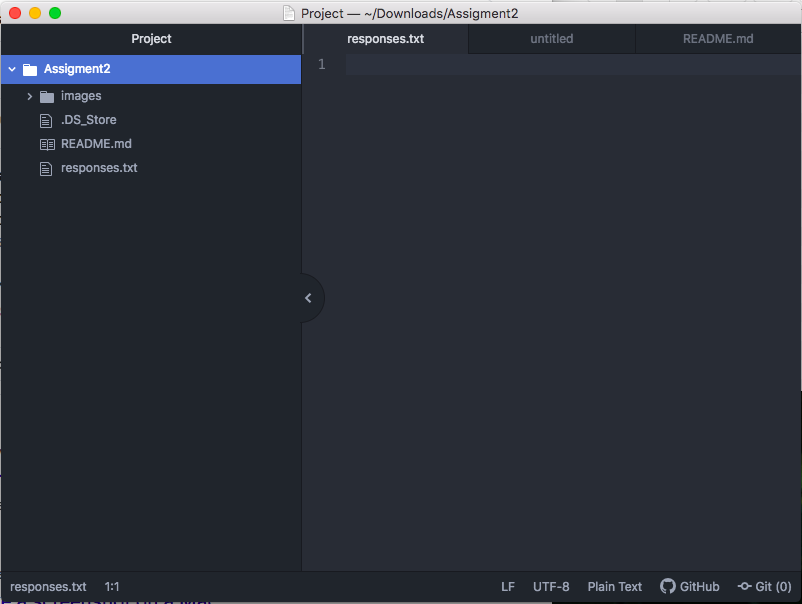

# Assigment2
## Con Clarke

I took this class because it could have a lot of value for my major. As a marketing major I will need to make websites to help promote the products I need to sell. Web design is also a useful skill to have with technology becoming more and more powerful.

1. How to properly layout a webpage
2. How to do drop down menus
3. How to insert my own logos into my webpage

[Evo](https://www.evo.com/)

[Responce file](./responses.txt)

